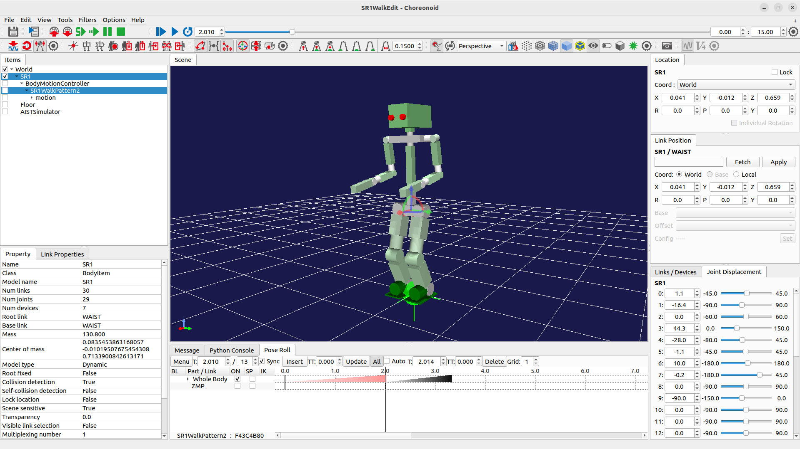
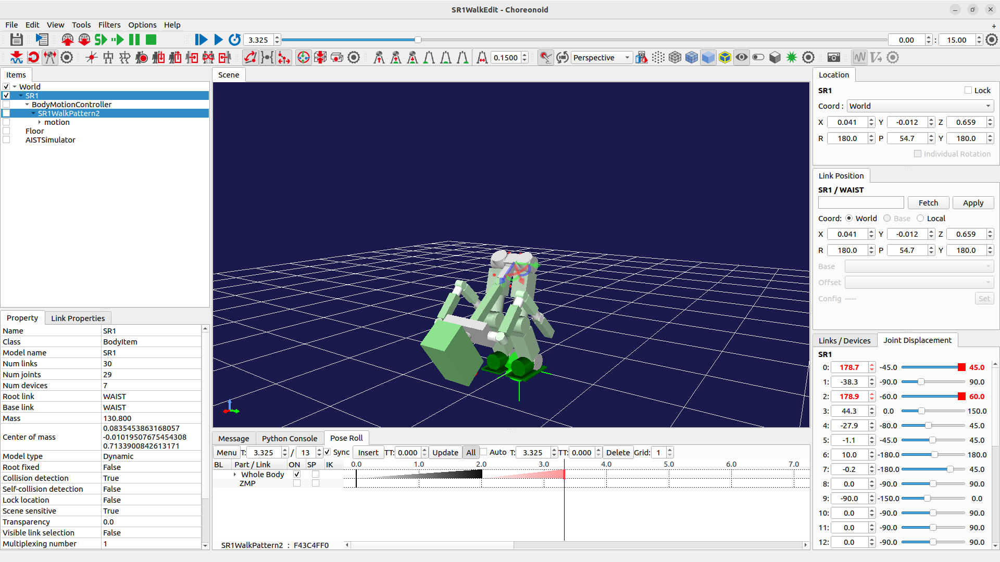
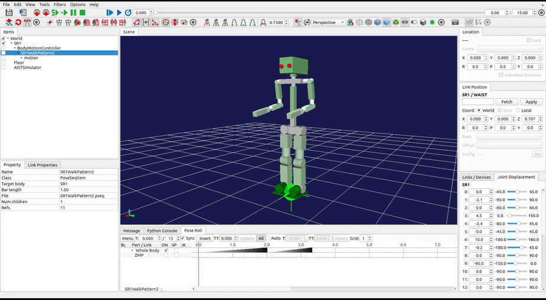

# Rotation interpolation bug of Choreonoid

## How to reproduce

```bash
cd choreonoid
./build/bin/choreonoid sample/PoseSeq/SR1WalkEdit.cnoid
```

Please load the pose sequence file here: [SR1WalkPattern2.pseq](https://github.com/matheecs/ws/blob/main/SR1WalkPattern2.pseq).

## Issue of interpolation

There are 3 keyframes in the pose sequence. I find the rotation interpolation of WAIST between the 2nd the 3rd keyframe is wrong.

* Rotation (RPY) of WAIST @ 2nd keyframe: `0, 0, 0`
* Rotation (RPY) of WAIST @ 3rd keyframe: `180, 54.7, 180`

I think the interpolation problem is due to the Euler angle. How about try to Quaternion.Slerp?

<p float="middle">
  
  
</p>

video recoded here:

<p float="middle">
  
</p>
